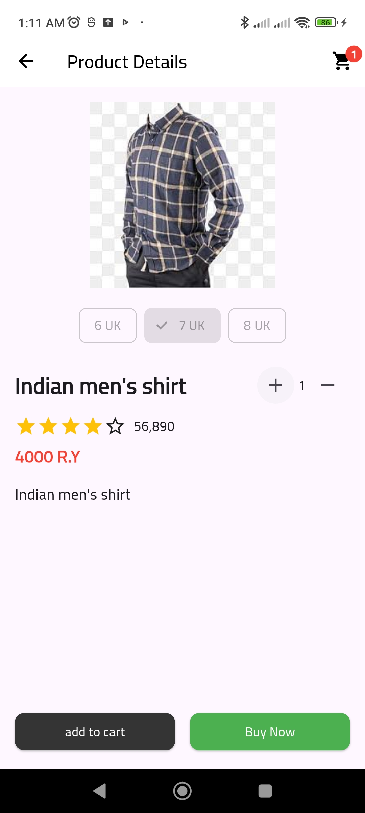
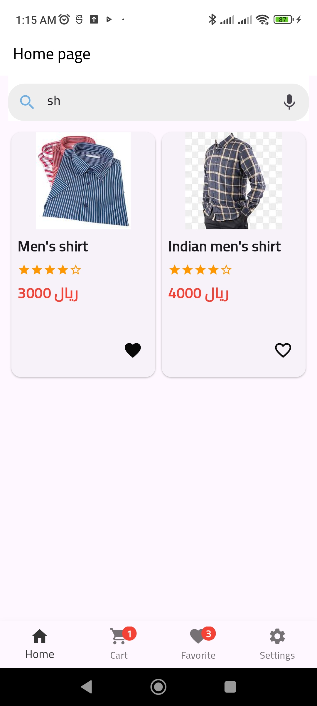

# ecommerce-new

ecommerce new

# structures project

```
/lib
│── main.dart # Main entry point of the application
│
├── core # Core files and essential structures
│ ├── api # API communication management
│ ├── constant # Definition of global constants like colors and routes
│ ├── localization # Language and localization management
│ ├── my_classes # General classes used in the project
│ ├── my_function # Utility functions and helpers
│ ├── services # Services such as database communication
│
├── controller # Application control and data interaction
│
├── data # Data sources
│ ├── models # Data models (Product, User, Order, etc.)
│ ├── remote # Handling data retrieval from servers or APIs
│
├── view # User Interface
│ ├── screen # Main application screens (Home, Cart, Profile, etc.)
│ ├── widget # Reusable UI components
```

## readme_image

### onboarding
<p align="start">
  
  
  
  
</p>

### authentication
<p align="start">
  
  
  
  
  
</p>

### user screan
<p align="start">
  
  
  
  
  
  
  
  
</p>


### dashboard screan
<p align="start">
  
  
  
  

</p>
